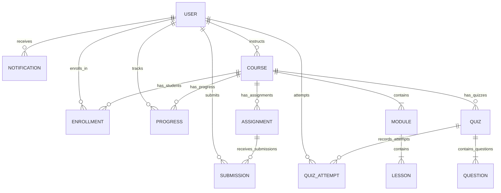

# LearnSphere LMS — Database Design & Schema Specification

## 1. Entity-Relationship (ER) Diagram

## 2. Schema Definitions & Field Catalogs

### 2.1 Collection: `users`
| Field | Type | Attributes | Description |
| :--- | :--- | :--- | :--- |
| `_id` | ObjectId | Primary Key | Unique user identifier |
| `name` | String | Required, trim, max: 60 | User's full name |
| `email` | String | Required, unique, index | Unique email address |
| `password` | String | Required, select: false | Bcrypt salted password hash |
| `role` | String | Enum: `['student', 'instructor', 'admin']` | Access tier role |
| `avatar` | String | Optional URL | Profile photo |
| `bio` | String | Optional, max: 500 | Profile bio description |
| `headline` | String | Optional, max: 100 | Title/Major |
| `isActive` | Boolean | Default: `true` | Account active flag |

### 2.2 Collection: `courses`
| Field | Type | Attributes | Description |
| :--- | :--- | :--- | :--- |
| `_id` | ObjectId | Primary Key | Course identifier |
| `title` | String | Required, max: 120 | Course title |
| `slug` | String | Lowercase, trim | URL-safe slug |
| `shortDescription` | String | Required, max: 200 | Overview snippet |
| `description` | String | Required | Full syllabus/overview |
| `instructor` | ObjectId | Ref: `User`, Required | Creator instructor |
| `category` | String | Enum, Required | Academic discipline |
| `difficulty` | String | Enum: `['beginner', 'intermediate', 'advanced']` | Skill level |
| `thumbnail` | String | URL | Cover banner |
| `status` | String | Enum: `['draft', 'published', 'archived']` | Publication state |
| `isFeatured` | Boolean | Default: `false` | Landing page highlight |

### 2.3 Collection: `modules` & `lessons`
- **`modules`**: `courseId` (Ref: `Course`), `title`, `description`, `order`.
- **`lessons`**: `courseId` (Ref: `Course`), `moduleId` (Ref: `Module`), `title`, `content` (Markdown/HTML), `videoUrl`, `durationMinutes`, `order`, `resources` (`[{ title, url, fileType }]`), `isFreePreview`.

### 2.4 Collection: `enrollments` & `progress`
- **`enrollments`**: `studentId` (Ref: `User`), `courseId` (Ref: `Course`), `enrolledAt`, `status` (`'active' | 'completed' | 'dropped'`). Compound Unique Index: `{ studentId: 1, courseId: 1 }`.
- **`progress`**: `studentId` (Ref: `User`), `courseId` (Ref: `Course`), `completedLessons` (`[{ lessonId, completedAt }]`), `lastAccessedLesson`, `percentage` (0-100), `isCompleted`. Compound Unique Index: `{ studentId: 1, courseId: 1 }`.

### 2.5 Collection: `assignments` & `submissions`
- **`assignments`**: `courseId`, `moduleId`, `instructorId`, `title`, `description`, `dueDate`, `maxMarks`, `attachmentUrl`, `status`.
- **`submissions`**: `assignmentId`, `studentId`, `courseId`, `content`, `attachmentUrl`, `submittedAt`, `isLate`, `status` (`'submitted' | 'graded' | 'resubmitted'`), `marksAwarded`, `feedback`, `gradedAt`, `gradedBy`. Compound Unique Index: `{ assignmentId: 1, studentId: 1 }`.

### 2.6 Collection: `quizzes`, `questions`, `quizattempts`
- **`quizzes`**: `courseId`, `instructorId`, `title`, `durationMinutes`, `passingScore`, `totalMarks`.
- **`questions`**: `quizId`, `questionText`, `options` (Array of 4), `correctAnswerIndex` (0..3), `explanation`, `marks`.
- **`quizattempts`**: `quizId`, `studentId`, `courseId`, `answers`, `score`, `totalMarks`, `percentage`, `passed`, `submittedAt`.
