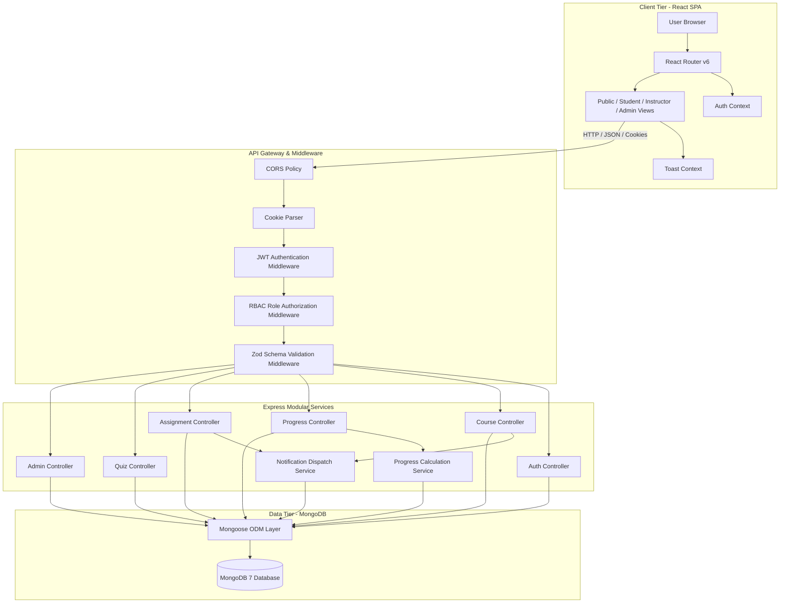

# LearnSphere LMS — System Architecture Document

## 1. Architectural Style: Decoupled Multi-Tier Architecture
LearnSphere adheres to a decoupled, multi-tier client-server architectural pattern. The frontend client (React SPA) and backend application (Express API) communicate exclusively through standardized RESTful JSON contracts over HTTPS with stateful cookie management.

## 2. Component Responsibility Layers

### 2.1 Presentation Tier (Frontend)
- **Framework**: React 18 + Vite.
- **Routing**: React Router v6 with `PublicLayout`, `StudentLayout`, `InstructorLayout`, and `AdminLayout`.
- **State Management**: React Context providers (`AuthContext`, `ToastContext`).
- **HTTP Client**: Axios with global request and response interceptors handling token fallback and error message normalization.
- **Styling**: Tailwind CSS with custom brand palette (`#6366f1` indigo, slate, emerald) and glassmorphism cards.

### 2.2 Application & Service Tier (Backend)
- **Runtime**: Node.js v26 + Express.js.
- **Separation of Concerns**:
  - `routes/`: Declares endpoints and connects middleware filters.
  - `middleware/`: Validates tokens (`protect`), enforces roles (`authorize`), validates input schemas (`validate(schema)`), and handles file uploads (`upload`).
  - `validators/`: Strictly typed Zod schemas guaranteeing contract fidelity.
  - `controllers/`: Handles HTTP request/response lifecycles and response status codes.
  - `services/`: Encapsulates reusable business calculations (e.g. dynamic progress math and notifications).
  - `utils/`: Centralized `AppError` and `apiResponse` formatting.

### 2.3 Persistence Tier (Database)
- **Database Engine**: MongoDB 7.0 running in Docker container mapped to port 27017.
- **ODM**: Mongoose with virtual populates, compound unique indexes, and pre-save hooks.
